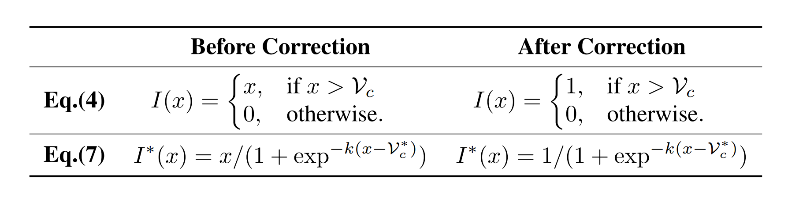

# ATL-Net
Learning Task-aware Local Representations for Few-shot Learning, IJCAI 2020

## Prerequisites
- Python 3
- PyTorch 1.4.0


## DataSets
Please refer to [DN4](https://github.com/WenbinLee/DN4).

##  Train & Test
- Train:
```bash
python -u trainer.py -c ./config/miniImageNet_Conv64F_5way_1shot.json -d 0
python -u trainer.py -c ./config/miniImageNet_Conv64F_5way_5shot.json -d 0
```
- Test:
```bash
python -u test.py -r ./results/miniImagenet_IMAGE2TASK_Conv64F_5way_1shot_1592608591 -d 0
python -u test.py -r ./results/miniImagenet_IMAGE2TASK_Conv64F_5way_5shot_1592635267 -d 0
```

## Note
Sorry about the mistakes in the Eq.(4) and the Eq.(7), 
the Eq.(4) is a step function, and Eq.(7) is still an approximation of the Eq.(4) with the adaptive threshold,
both of them repeatedly introduce the process of Eq.(5),
the paper after correction is [here](https://github.com/LegenDong/ATL-Net/pdf/ATL-Net_Update.pdf).



## Citation
If you use this code for your research, please cite our paper.
```
@inproceedings{DBLP:conf/ijcai/DongLHGG20,
  author    = {Chuanqi Dong and
               Wenbin Li and
               Jing Huo and
               Zheng Gu and
               Yang Gao},
  editor    = {Christian Bessiere},
  title     = {Learning Task-aware Local Representations for Few-shot Learning},
  booktitle = {Proceedings of the Twenty-Ninth International Joint Conference on
               Artificial Intelligence, {IJCAI} 2020 [scheduled for July 2020, Yokohama,
               Japan, postponed due to the Corona pandemic]},
  pages     = {716--722},
  publisher = {ijcai.org},
  year      = {2020},
  url       = {https://doi.org/10.24963/ijcai.2020/100},
  doi       = {10.24963/ijcai.2020/100},
  timestamp = {Sat, 11 Jul 2020 14:56:00 +0200},
  biburl    = {https://dblp.org/rec/conf/ijcai/DongLHGG20.bib},
  bibsource = {dblp computer science bibliography, https://dblp.org}
}
```

## Reference
Our code is based on [DN4](https://github.com/WenbinLee/DN4).

